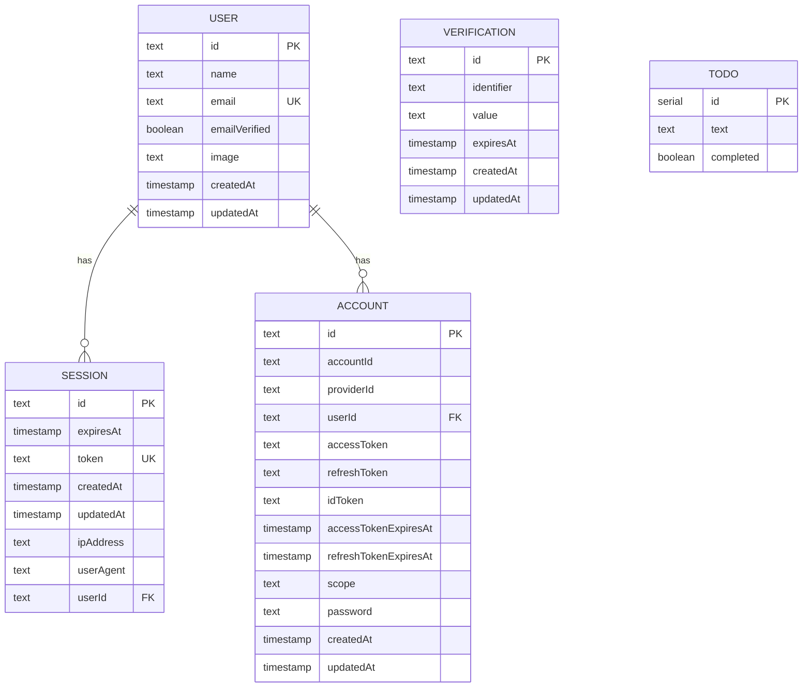

# Data Model Documentation

This document describes the database schema and data models used in the application.

## Overview

The application uses PostgreSQL as the database with Drizzle ORM for type-safe database operations. The schema is organized into two main domains:

- **Authentication**: User management, sessions, and OAuth accounts
- **Application Data**: Core application features (todos, etc.)

## Database Provider

- **Database**: PostgreSQL (via Supabase)
- **ORM**: Drizzle ORM
- **Location**: `/packages/db/src/schema/`

---

## Authentication Schema

The authentication system uses [Better Auth](https://www.better-auth.com/) for secure user authentication and session management.

### User Table

**Table Name**: `user`

Stores registered user information.

| Column          | Type        | Constraints      | Description                         |
| --------------- | ----------- | ---------------- | ----------------------------------- |
| `id`            | `text`      | PRIMARY KEY      | Unique user identifier              |
| `name`          | `text`      | NOT NULL         | User's display name                 |
| `email`         | `text`      | NOT NULL, UNIQUE | User's email address                |
| `emailVerified` | `boolean`   | NOT NULL         | Whether the email has been verified |
| `image`         | `text`      | NULLABLE         | URL to user's profile image         |
| `createdAt`     | `timestamp` | NOT NULL         | Account creation timestamp          |
| `updatedAt`     | `timestamp` | NOT NULL         | Last update timestamp               |

**Relationships**:

- One user can have many sessions (one-to-many)
- One user can have many accounts (one-to-many)

---

### Session Table

**Table Name**: `session`

Manages active user sessions for authentication.

| Column      | Type        | Constraints           | Description                      |
| ----------- | ----------- | --------------------- | -------------------------------- |
| `id`        | `text`      | PRIMARY KEY           | Unique session identifier        |
| `expiresAt` | `timestamp` | NOT NULL              | Session expiration timestamp     |
| `token`     | `text`      | NOT NULL, UNIQUE      | Session token for authentication |
| `createdAt` | `timestamp` | NOT NULL              | Session creation timestamp       |
| `updatedAt` | `timestamp` | NOT NULL              | Last update timestamp            |
| `ipAddress` | `text`      | NULLABLE              | IP address of the session        |
| `userAgent` | `text`      | NULLABLE              | Browser/client user agent string |
| `userId`    | `text`      | NOT NULL, FOREIGN KEY | Reference to user                |

**Relationships**:

- `userId` → `user.id` (CASCADE DELETE)

---

### Account Table

**Table Name**: `account`

Stores OAuth provider accounts and credentials linked to users.

| Column                  | Type        | Constraints           | Description                                          |
| ----------------------- | ----------- | --------------------- | ---------------------------------------------------- |
| `id`                    | `text`      | PRIMARY KEY           | Unique account identifier                            |
| `accountId`             | `text`      | NOT NULL              | Provider-specific account ID                         |
| `providerId`            | `text`      | NOT NULL              | OAuth provider identifier (e.g., 'google', 'github') |
| `userId`                | `text`      | NOT NULL, FOREIGN KEY | Reference to user                                    |
| `accessToken`           | `text`      | NULLABLE              | OAuth access token                                   |
| `refreshToken`          | `text`      | NULLABLE              | OAuth refresh token                                  |
| `idToken`               | `text`      | NULLABLE              | OAuth ID token                                       |
| `accessTokenExpiresAt`  | `timestamp` | NULLABLE              | Access token expiration                              |
| `refreshTokenExpiresAt` | `timestamp` | NULLABLE              | Refresh token expiration                             |
| `scope`                 | `text`      | NULLABLE              | OAuth scope granted                                  |
| `password`              | `text`      | NULLABLE              | Hashed password for credential-based auth            |
| `createdAt`             | `timestamp` | NOT NULL              | Account creation timestamp                           |
| `updatedAt`             | `timestamp` | NOT NULL              | Last update timestamp                                |

**Relationships**:

- `userId` → `user.id` (CASCADE DELETE)

---

### Verification Table

**Table Name**: `verification`

Stores verification tokens for email verification and password resets.

| Column       | Type        | Constraints | Description                    |
| ------------ | ----------- | ----------- | ------------------------------ |
| `id`         | `text`      | PRIMARY KEY | Unique verification identifier |
| `identifier` | `text`      | NOT NULL    | Email or identifier to verify  |
| `value`      | `text`      | NOT NULL    | Verification token/code        |
| `expiresAt`  | `timestamp` | NOT NULL    | Token expiration timestamp     |
| `createdAt`  | `timestamp` | NULLABLE    | Token creation timestamp       |
| `updatedAt`  | `timestamp` | NULLABLE    | Last update timestamp          |

**Use Cases**:

- Email verification for new accounts
- Password reset tokens
- Magic link authentication

---

## Application Schema

### Todo Table

**Table Name**: `todo`

Stores user todo items.

| Column      | Type      | Constraints             | Description                         |
| ----------- | --------- | ----------------------- | ----------------------------------- |
| `id`        | `serial`  | PRIMARY KEY             | Auto-incrementing unique identifier |
| `text`      | `text`    | NOT NULL                | Todo item content/description       |
| `completed` | `boolean` | NOT NULL, DEFAULT false | Whether the todo is completed       |

**Notes**:

- Currently no user relationship (global todos)
- Consider adding `userId` foreign key for user-specific todos

---

## Entity Relationship Diagram



---

## Database Operations

### Accessing the Schema

```typescript
import { user, session, account, verification, todo } from "@hocbaichua/db";
```

### Configuration

Database configuration is managed in:

- `/packages/db/drizzle.config.ts` - Drizzle configuration
- `/packages/db/supabase/config.toml` - Supabase local development config

---

## Future Considerations

### Potential Enhancements

1. **Todo Table**:
   - Add `userId` foreign key to associate todos with users
   - Add `createdAt` and `updatedAt` timestamps
   - Add `priority` or `dueDate` fields

2. **User Table**:
   - Add role-based access control (RBAC) fields
   - Add user preferences/settings

3. **Additional Tables**:
   - Consider tables for learning content, progress tracking, etc.
   - Add audit logging tables for compliance

---

## References

- [Better Auth Documentation](https://www.better-auth.com/docs/concepts/database)
- [Drizzle ORM Documentation](https://orm.drizzle.team/)
- [Supabase PostgreSQL Documentation](https://supabase.com/docs/guides/database)
