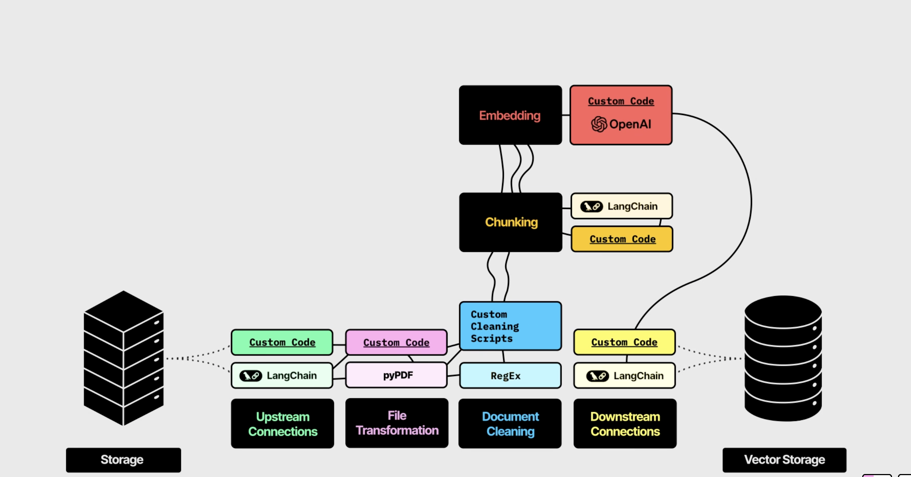

# Introduction

This document provides an overview of the document processing capabilities of the HocBaiChua platform. It covers the steps involved in uploading, storing, and extracting information from documents using our API and background task processing system.

Reference: [Unstructured](https://unstructured.io/)

# Terminology

- **Document Upload**: The process of uploading documents to the platform, which includes storing the files and their metadata.
- **Vector DB**: A database optimized for storing and querying vector representations of data, often
  used in machine learning and AI applications.
- **Trigger.dev**: A background task processing system used to handle long-running tasks asynchronously.

## AI Terms

- **Chunk**: A smaller segment of a document, typically used for processing large texts in manageable pieces.
- **Embedding**: A numerical representation of text or data in a vector space, used for similarity searches and machine learning.
- **LLM (Large Language Model)**: A type of AI model designed to understand and generate human-like text based on large datasets.
