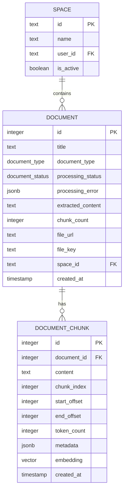

# Data Model: Document Ingestion Pipeline

**Feature**: 002-document-ingestion
**Date**: 2024-12-14
**Status**: Complete

## Overview

This document defines the database schema extensions required for the document ingestion pipeline. Changes extend the existing `document` table and add new tables for chunks and embeddings.

---

## Schema Changes

### 1. Document Table Extensions

**Table**: `document` (existing)
**Changes**: Add processing status tracking and extracted content storage

| Column              | Type                     | Constraints                  | Description                        |
| ------------------- | ------------------------ | ---------------------------- | ---------------------------------- |
| `processing_status` | `document_status` (enum) | NOT NULL, DEFAULT 'UPLOADED' | Current pipeline stage             |
| `processing_error`  | `jsonb`                  | NULLABLE                     | Error details if processing failed |
| `extracted_content` | `text`                   | NULLABLE                     | Full extracted text from document  |
| `chunk_count`       | `integer`                | DEFAULT 0                    | Number of chunks created           |

**New Enum**: `document_status`

```sql
CREATE TYPE document_status AS ENUM (
  'UPLOADED',    -- Initial state after upload
  'EXTRACTING',  -- Text extraction in progress
  'CHUNKING',    -- Text splitting in progress
  'EMBEDDING',   -- Vector generation in progress
  'READY',       -- Processing complete, searchable
  'ERROR'        -- Processing failed
);
```

---

### 2. Document Chunk Table (New)

**Table**: `document_chunk`
**Purpose**: Store text segments with metadata for retrieval

| Column         | Type          | Constraints                                | Description                                 |
| -------------- | ------------- | ------------------------------------------ | ------------------------------------------- |
| `id`           | `integer`     | PRIMARY KEY, GENERATED ALWAYS AS IDENTITY  | Unique chunk identifier                     |
| `document_id`  | `integer`     | NOT NULL, FK → document.id, CASCADE DELETE | Parent document reference                   |
| `content`      | `text`        | NOT NULL                                   | Chunk text content                          |
| `chunk_index`  | `integer`     | NOT NULL                                   | Position in document (0-indexed)            |
| `start_offset` | `integer`     | NOT NULL                                   | Character offset start in extracted content |
| `end_offset`   | `integer`     | NOT NULL                                   | Character offset end in extracted content   |
| `token_count`  | `integer`     | NULLABLE                                   | Estimated token count for LLM context       |
| `metadata`     | `jsonb`       | NULLABLE                                   | Additional chunk metadata                   |
| `embedding`    | `vector(768)` | NULLABLE                                   | Vector embedding for similarity search      |
| `created_at`   | `timestamp`   | NOT NULL                                   | Chunk creation timestamp                    |

**Indexes**:

- `idx_chunk_document_id` on `document_id` - Fast lookup by document
- `idx_chunk_embedding_hnsw` HNSW on `embedding` - Fast vector similarity search

**Relationships**:

- `document_chunk.document_id` → `document.id` (CASCADE DELETE)

---

## Entity Relationship Diagram



---

## Drizzle Schema Implementation

### packages/db/src/schema/space.ts (Extended)

```typescript
import {
  boolean,
  index,
  integer,
  jsonb,
  pgEnum,
  pgTable,
  text,
  vector,
} from "drizzle-orm/pg-core";
import { timestampColumns } from "../helpers/columns.helper";
import { user } from "./auth";

// Existing enums
export const documentTypeEnum = pgEnum("document_type", [
  "EXTENSION",
  "CRAWLED_URL",
  "FILE",
  "YOUTUBE_VIDEO",
]);

// NEW: Processing status enum
export const documentStatusEnum = pgEnum("document_status", [
  "UPLOADED",
  "EXTRACTING",
  "CHUNKING",
  "EMBEDDING",
  "READY",
  "ERROR",
]);

// Existing space table
export const space = pgTable("space", {
  id: text("id").primaryKey(),
  name: text("name").notNull(),
  description: text("description"),
  isActive: boolean("is_active").notNull().default(true),
  ...timestampColumns,
  userId: text("user_id")
    .notNull()
    .references(() => user.id, { onDelete: "cascade" }),
});

// MODIFIED: Document table with new columns
export const document = pgTable(
  "document",
  {
    id: integer("id").primaryKey().generatedAlwaysAsIdentity(),
    title: text("title").notNull(),
    documentType: documentTypeEnum("document_type").notNull(),
    documentMetadata: jsonb("document_metadata"),
    content: text("content").notNull(),
    contentHash: text("content_hash").notNull().unique(),
    uniqueIdentifierHash: text("unique_identifier_hash").notNull().unique(),
    // File upload specific fields
    fileUrl: text("file_url"),
    fileKey: text("file_key"),
    fileSize: text("file_size"),
    fileMimeType: text("file_mime_type"),
    spaceId: text("space_id")
      .notNull()
      .references(() => space.id, { onDelete: "cascade" }),
    // NEW: Processing status fields
    processingStatus: documentStatusEnum("processing_status")
      .notNull()
      .default("UPLOADED"),
    processingError: jsonb("processing_error").$type<{
      message: string;
      stage: string;
      timestamp: string;
    }>(),
    extractedContent: text("extracted_content"),
    chunkCount: integer("chunk_count").notNull().default(0),
    ...timestampColumns,
  },
  (table) => [
    index("document_title_idx").on(table.title),
    index("document_space_id_idx").on(table.spaceId),
    index("document_type_idx").on(table.documentType),
    index("document_status_idx").on(table.processingStatus), // NEW
  ]
);

// NEW: Document chunk table
export const documentChunk = pgTable(
  "document_chunk",
  {
    id: integer("id").primaryKey().generatedAlwaysAsIdentity(),
    documentId: integer("document_id")
      .notNull()
      .references(() => document.id, { onDelete: "cascade" }),
    content: text("content").notNull(),
    chunkIndex: integer("chunk_index").notNull(),
    startOffset: integer("start_offset").notNull(),
    endOffset: integer("end_offset").notNull(),
    tokenCount: integer("token_count"),
    metadata: jsonb("metadata"),
    embedding: vector("embedding", { dimensions: 768 }),
    createdAt: timestamp("created_at").notNull().defaultNow(),
  },
  (table) => [
    index("chunk_document_id_idx").on(table.documentId),
    // HNSW index for vector similarity search
    // Note: This index should be created via migration SQL for proper operator class
  ]
);
```

### packages/db/src/schema/relations.ts (Extended)

```typescript
import { relations } from "drizzle-orm/relations";
import { document, documentChunk, space } from "./space";

// Existing relations...

// NEW: Document to chunks relation
export const documentChunkRelations = relations(documentChunk, ({ one }) => ({
  document: one(document, {
    fields: [documentChunk.documentId],
    references: [document.id],
  }),
}));

// MODIFIED: Add chunks to document relations
export const documentRelations = relations(document, ({ one, many }) => ({
  space: one(space, {
    fields: [document.spaceId],
    references: [space.id],
  }),
  chunks: many(documentChunk), // NEW
}));
```

---

## Migration SQL

```sql
-- Migration: 002_document_ingestion
-- Description: Add processing status and chunk tables for document ingestion

-- 1. Create document status enum
CREATE TYPE document_status AS ENUM (
  'UPLOADED',
  'EXTRACTING',
  'CHUNKING',
  'EMBEDDING',
  'READY',
  'ERROR'
);

-- 2. Add new columns to document table
ALTER TABLE document
ADD COLUMN processing_status document_status NOT NULL DEFAULT 'UPLOADED',
ADD COLUMN processing_error jsonb,
ADD COLUMN extracted_content text,
ADD COLUMN chunk_count integer NOT NULL DEFAULT 0;

-- 3. Create index on processing status
CREATE INDEX document_status_idx ON document (processing_status);

-- 4. Enable pgvector extension (if not already enabled)
CREATE EXTENSION IF NOT EXISTS vector;

-- 5. Create document_chunk table
CREATE TABLE document_chunk (
  id integer PRIMARY KEY GENERATED ALWAYS AS IDENTITY,
  document_id integer NOT NULL REFERENCES document(id) ON DELETE CASCADE,
  content text NOT NULL,
  chunk_index integer NOT NULL,
  start_offset integer NOT NULL,
  end_offset integer NOT NULL,
  token_count integer,
  metadata jsonb,
  embedding vector(768),
  created_at timestamp NOT NULL DEFAULT NOW()
);

-- 6. Create indexes on document_chunk
CREATE INDEX chunk_document_id_idx ON document_chunk (document_id);

-- 7. Create HNSW index for vector similarity search
-- Using cosine distance operator class
CREATE INDEX chunk_embedding_hnsw_idx ON document_chunk
USING hnsw (embedding vector_cosine_ops);

-- 8. Update existing documents to READY status if they have content
-- (Optional: for backward compatibility with existing documents)
UPDATE document
SET processing_status = 'READY'
WHERE content IS NOT NULL AND content != '';
```

---

## Type Definitions

### Processing Error Type

```typescript
export interface ProcessingError {
  message: string;
  stage: "EXTRACTING" | "CHUNKING" | "EMBEDDING";
  timestamp: string; // ISO 8601
  details?: Record<string, unknown>;
}
```

### Chunk Metadata Type

```typescript
export interface ChunkMetadata {
  elementType?: string; // From Unstructured.io (e.g., "NarrativeText", "Title")
  pageNumber?: number; // For PDF documents
  section?: string; // Document section/heading
}
```

---

## Query Examples

### Get document with processing status

```typescript
const doc = await db.query.document.findFirst({
  where: eq(document.id, documentId),
  columns: {
    id: true,
    title: true,
    processingStatus: true,
    processingError: true,
    chunkCount: true,
  },
});
```

### Get chunks for a document

```typescript
const chunks = await db.query.documentChunk.findMany({
  where: eq(documentChunk.documentId, documentId),
  orderBy: [asc(documentChunk.chunkIndex)],
});
```

### Similarity search (raw SQL via Drizzle)

```typescript
const similarChunks = await db.execute(sql`
  SELECT 
    dc.id,
    dc.content,
    dc.document_id,
    1 - (dc.embedding <=> ${queryEmbedding}::vector) as similarity
  FROM document_chunk dc
  JOIN document d ON dc.document_id = d.id
  WHERE d.space_id = ${spaceId}
    AND dc.embedding IS NOT NULL
  ORDER BY dc.embedding <=> ${queryEmbedding}::vector
  LIMIT ${limit}
`);
```

---

## Backward Compatibility

- Existing documents will have `processing_status = 'UPLOADED'` by default
- Migration updates documents with content to `READY` status
- No changes to existing API contracts for document creation
- Chunk table is additive (no impact on existing functionality)
